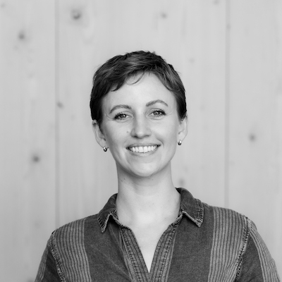

# People

## [Serge Belongie](https://vision.cornell.edu/se3/people/serge-belongie/)

Cornell Tech

[Google Scholar](https://scholar.google.com/citations?user=ORr4XJYAAAAJ&hl=en&oi=ao)

---

## [Pietro Perona](http://www.vision.caltech.edu/Perona.html)  

Caltech   

[Google Scholar](https://scholar.google.com/citations?hl=en&user=j29kMCwAAAAJ)

 

---

## [Oisin Mac Aodha](https://homepages.inf.ed.ac.uk/omacaod/)

University of Edinburgh

[Google Scholar](https://scholar.google.com/citations?hl=en&user=IfZBjkUAAAAJ)

---

## [Grant Van Horn](https://gvanhorn38.github.io/)

Cornell

[Google Scholar](https://scholar.google.com/citations?hl=en&user=PxYY_nsAAAAJ)

---

## [Sara Beery](https://beerys.github.io/)

Caltech

[Google Scholar](https://scholar.google.com/citations?hl=en&user=Hbr4c10AAAAJ)

---

## [Elijah Cole](https://elijahcole.me/)

Caltech

[Google Scholar](https://scholar.google.com/citations?hl=en&user=-atuVWQAAAAJ)

---

## [Jess Sullivan](https://www.linkedin.com/in/jess-sullivan-49a678172)

Cornell Lab of Ornithology

 

---

## Kimberly Wilber

Google

[Google Scholar](https://scholar.google.com/citations?hl=en&user=OAtUvx0AAAAJ)

 
 

---

## [Christine Kaeser-Chen](https://www.linkedin.com/in/christinekaeserchen)

DeepMind

[Google Scholar](https://scholar.google.com/citations?hl=en&user=D9VWpjoAAAAJ)

---

## [Jessie Barry](https://www.birds.cornell.edu/home/staff/jessie-barry/)

Cornell Lab of Ornithology

 

---

## [Cullen Hanks](https://www.birds.cornell.edu/home/staff/cullen-hanks/)

Cornell Lab of Ornithology

 

---

## Alumni

Steve Branson

Catherine Wah

Peter Wellinder

Yin Cui

Andreas Veit

Genevieve Patterson

Tomas Matera

Jan Jakes
